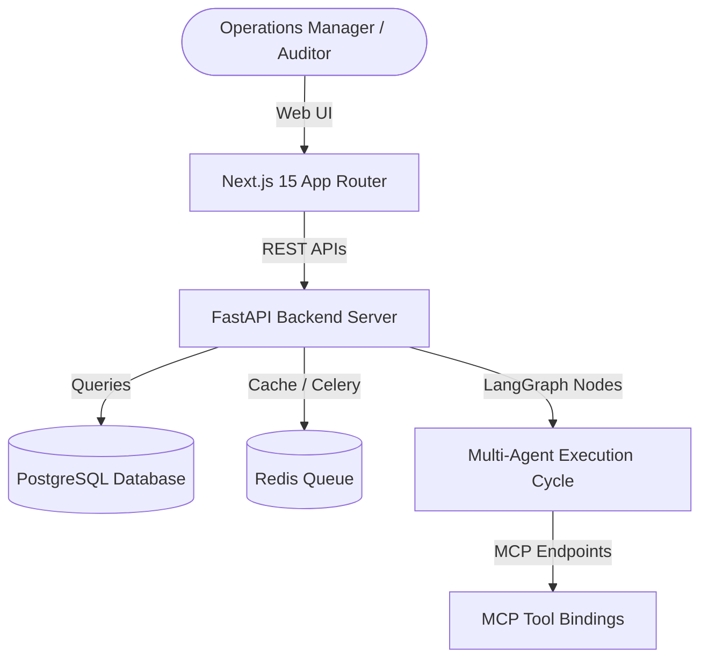

# System Architecture Design

This document details the software architectural decisions, data flows, and multi-agent coordination paths for the platform.

---

## 1. High-Level System Design

---

## 2. Multi-Agent Orchestration Sequence (LangGraph)

The platform implements a StateGraph coordination sequence where context is shared between specialized agent nodes:

1. **Reconciliation Agent:** Scans ERP quantities against WMS and physical audit records to identify stock level mismatches.
2. **Root Cause Agent:** Analyzes transaction timelines, receipts, and order histories to categorize the mismatch root cause (e.g. dock damage, storage misplacements).
3. **Supplier Intelligence Agent:** Assesses delivery reliability histories of associated vendors, computing fulfillment risk metrics.
4. **Infrastructure Agent:** Inspects environmental telemetry logs (temp/humidity) from warehouse sensors to diagnose equipment health.
5. **Forecast Agent:** Projects future safety limits and restock requirements for flagged SKUs.
6. **Audit Agent:** Computes compliance percentages, signs the execution log, and writes tamper-evident audit logs.

---

## 3. Database Schema Layout

The database includes 16 relational schemas matching corporate objects:
- Multi-Tenancy: `organizations`, `users`.
- Facility & Supply Chain: `warehouses`, `suppliers`, `purchase_orders`, `goods_receipts`, `shipments`.
- Stock: `inventory_items` (100k SKUs), `inventory_transactions` (2m records).
- Diagnostics: `infrastructure_assets`, `iot_sensors`, `alerts`.
- AI Decisions: `forecasts`, `agent_executions`, `reconciliation_results`, `audit_logs`.
